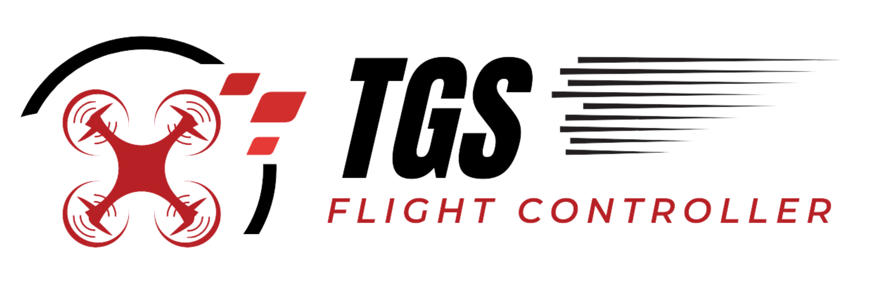
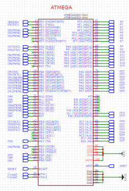

<h1 align="center"></img></h1>


<p align="center"><b><i>Flight Controller Developing by @thxssio</i></b></p>


<p align="center">
<a href="/LICENSE"></a>
</p>


Install board:

```
https://www.pjrc.com/teensy/package_teensy_index.json
```

- MPU6050
- BMP2080
- TGS Board
- C/CPP/Python


#


 **Enginner Schematic**
<h1 align="center"></img></h1>


