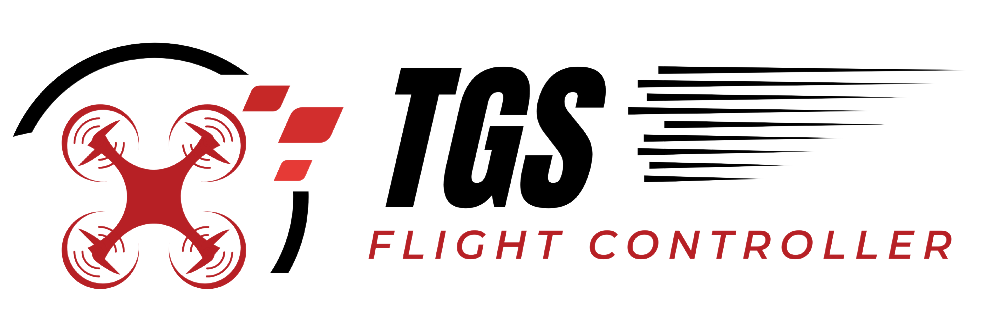
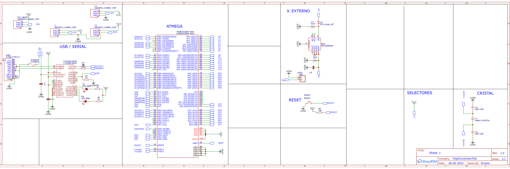
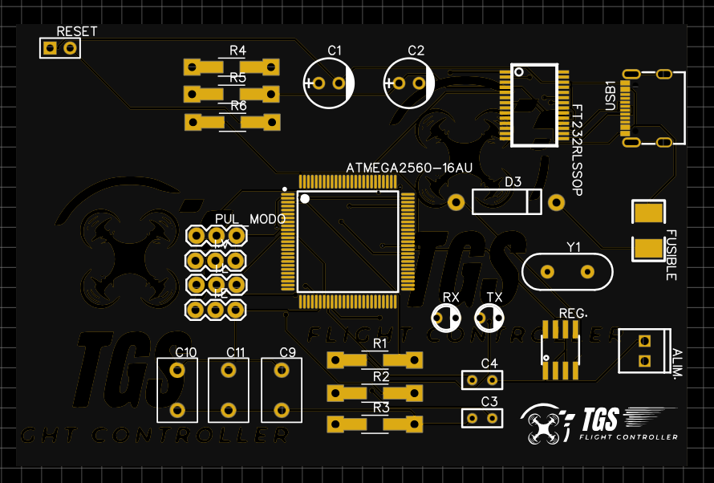
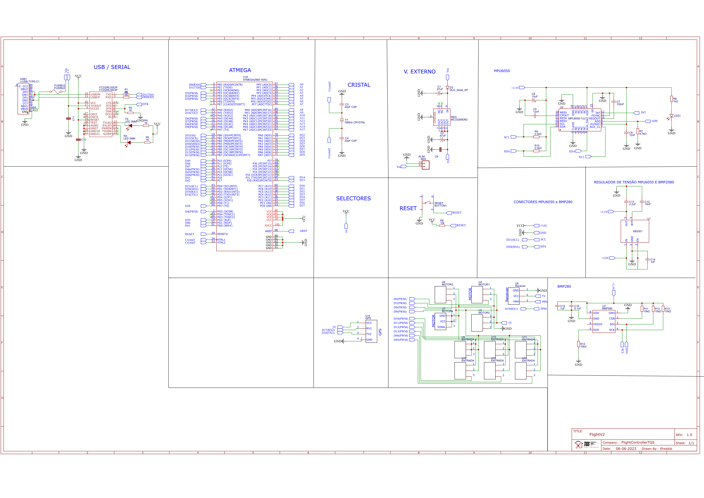

<h1 align="center"></img></h1>

<b><i>Flight Controller Developing by @thxssio</i></b>

#

- MPU6050
- BMP2080
- TGS Board (Atmega v1) >> Update STM32 ( Em desenvolvimento)
- C/CPP/Python
- ROS and ROS2

#
 **Enginner Schematic:**

<h1 align="center"></img></h1>
<h1 align="center"></img></h1>

Update Schematics

<h1 align="center"></img></h1>

